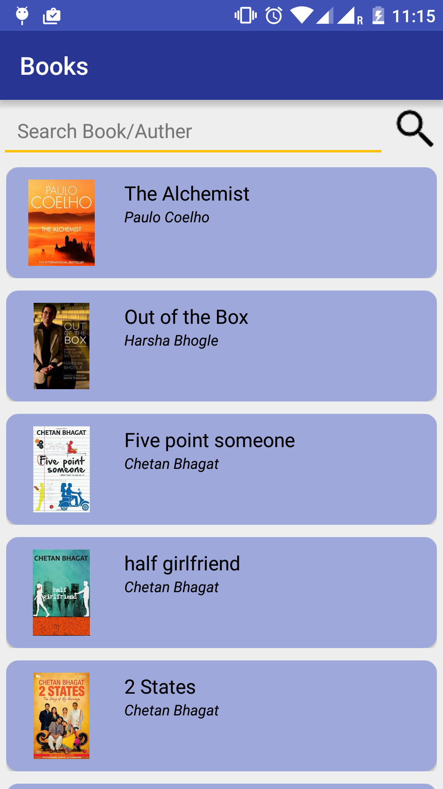
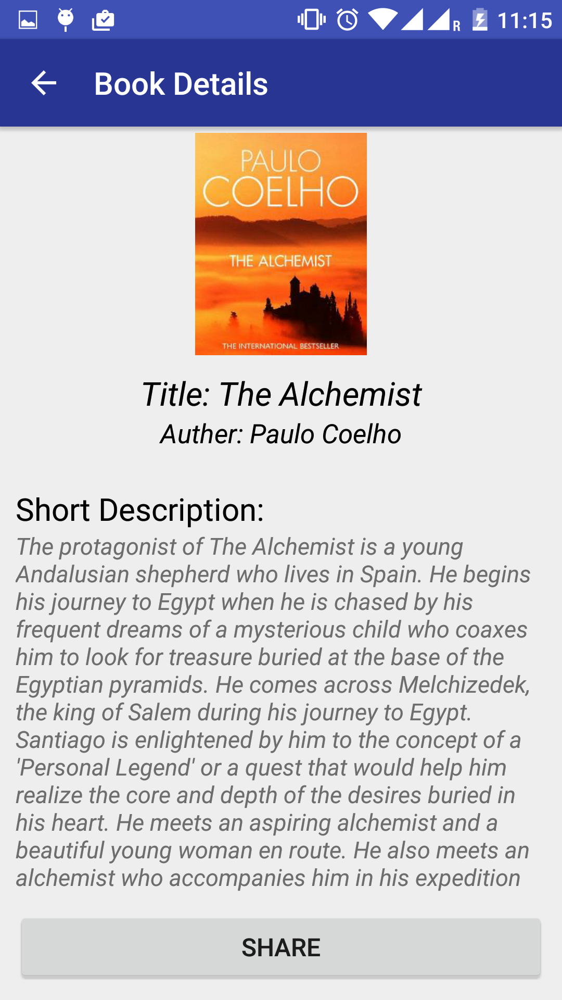
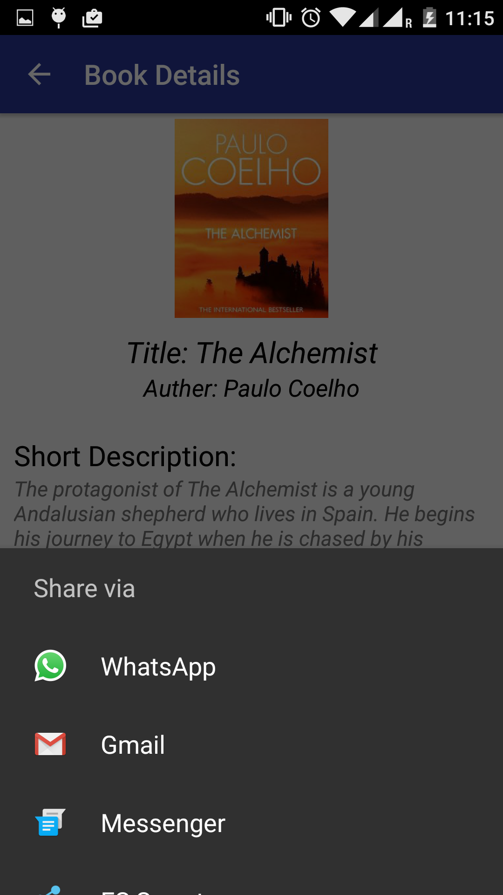

# Books

My books app
This application provides following functionalities 
1) Search book on google book api 
2) View book details such as title, auther and its short description. 
3) Share the book details with friends 

Information shown on home page of this app is list of static books. 
When user search the books this list will be replaced by the list of books got from the google books api. 

Project Sreenshots:

Home Page: 
 

After clicking on a book a new page will be open showing the details of that book. 
 

We can share this book information with our contacts: 
 
